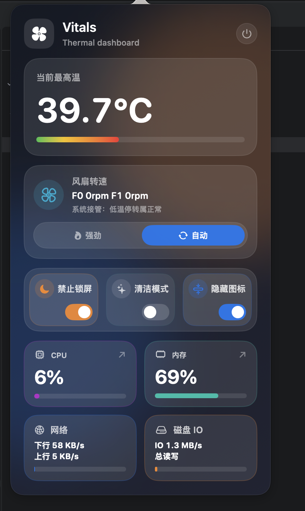

# Vitals

Vitals 是一款轻量、原生的 macOS 菜单栏系统监控工具。它将温度、风扇、CPU、内存、网络和磁盘状态集中在一个紧凑面板中，无需常驻桌面，需要时点击菜单栏即可查看。

## 主要功能

### 实时系统监控

- 显示设备当前最高温度，并通过颜色进度条直观反映温度水平
- 显示各风扇的实时转速
- 显示 CPU 和内存使用率
- 显示网络实时下载、上传速率
- 显示磁盘实时读写速率
- 每秒自动刷新，无需手动操作

### 风扇控制

- **自动模式**：由 macOS 根据设备温度自动管理风扇
- **强劲模式**：将支持的风扇切换到最大转速，帮助设备快速散热
- 自动检测设备风扇数量及控制能力
- 保存当前风扇模式，重新打开应用后继续显示上次状态

首次使用风扇控制时，Vitals 会请求管理员权限以安装本地控制组件。无风扇机型或无法访问 SMC 的设备仍可使用其他系统监控功能，但不会显示风扇控制区域。

### 进程详情

点击 CPU 或内存卡片可打开进程详情窗口：

- 查看进程名称、PID、CPU 占比、核心占用和内存使用量
- 按任意指标升序或降序排列
- 按进程名、完整路径或 PID 搜索
- 复制进程完整路径
- 强制结束指定进程

### 实用开关

- **禁止锁屏**：阻止系统自动锁屏或休眠，适合下载、演示和长时间任务
- **清洁模式**：锁定键盘并黑屏，屏幕显示 2 分钟倒计时；长按 `Esc` 5 秒可提前解锁
- **隐藏图标**：提供菜单栏图标收纳功能，减少菜单栏占用
- 自动保存开关状态，下次启动时恢复

## 安装与使用

1. 打开 `Vitals-0.1.0-arm64.dmg`。
2. 将 `Vitals.app` 拖入“应用程序”文件夹。
3. 启动 Vitals，菜单栏会出现应用入口。
4. 点击菜单栏中的 Vitals 即可打开监控面板。

## 系统要求

- macOS 13.0 或更高版本
- Apple Silicon（arm64）
- 温度和风扇功能取决于具体机型的 SMC 与硬件支持

## 使用提示

- 强劲模式会提高噪音和耗电，仅建议在高负载或高温时使用。
- 不需要强制散热时，请切回“自动”模式，将风扇控制交还给 macOS。
- 首次使用清洁模式时，需要在系统设置中允许 Vitals 使用辅助功能/输入监控权限。
- 强制结束系统关键进程可能导致应用退出、数据丢失或系统异常，请谨慎使用。

## 当前版本

`0.1.0`
